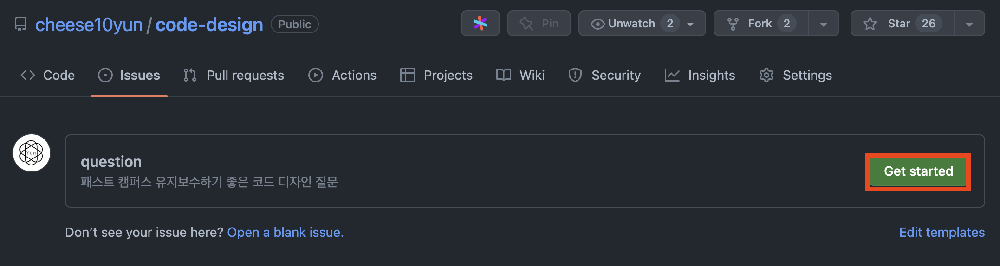

# 패스트 캠퍼스 유지보수하기 좋은 코드 디자인
[패스트 캠퍼스 유지보수하기 좋은 코드 디자인](https://fastcampus.co.kr/dev_online_spring) 예제 코드

# Q&A

Q&A는 [Issues question](https://githubcom/cheese10yun/code-design/issues)을 통해서 작성해 주시면 답변드리겠습니다.
